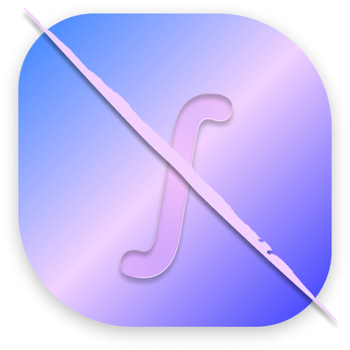

<div align="center">

  
  <h1>Haje</h1>
  <p>A linear algebra library developed in Rust, focusing on providing a clean and intuitive API for common mathematical operations.</p>

  <p>
    <a href="https://crates.io/crates/haje"></a>
    <a href="https://rust-lang.org"></a>
    <a href="LICENSE"></a>
    <a href="https://github.com/Jadiefication/Haje/actions"></a>
  </p>
</div>

Haje is a small, unopinionated library you can embed into your Rust app. It provides:

- **Complex Numbers**: Full implementation of complex number arithmetic.
- **Vectors**: Generic `Vec2`, `Vec3`, and `Vec4` types with standard operations.
- **Matrices**: Support for arbitrary dimensions using const generics: `Matrix<T, ROWS, COLS>`.
- **Physics & Grids**: Wave packet generation and discrete Laplacian operator.
- **Quantum Computing**: Qubit state containers and tensor-product helpers.

Quick links

- Security policy: [SECURITY.md](SECURITY.md)
- Contributing guide: [CONTRIBUTING.md](CONTRIBUTING.md)
- Code of Conduct: [CODE_OF_CONDUCT.md](CODE_OF_CONDUCT.md)
- Support: [SUPPORT.md](SUPPORT.md)
- License: MIT ([LICENSE](LICENSE))
- Repository: [GitHub](https://github.com/Jadiefication/Haje)

## Tech Stack

- **Language:** [Rust (2024 edition)](https://rust-lang.org/)
- **Build System:** [Cargo](https://doc.rust-lang.org/cargo/)
- **Minimum Rust:** 1.80+ (for const generics support used in the library)
- **Frameworks:** Standard library, `num-traits` (planned)
- **Distribution:** [Crates.io](https://crates.io/)

## Project Structure

- `src/`: The core library source code.
  - `complex.rs`: Complex number arithmetic.
  - `matrix.rs`: Generic matrix implementation.
  - `quantum/`: Qubit and quantum gate logic.
  - `vec/`: Vector implementations (`Vec2`, `Vec3`, `Vec4`).
- `tests/`: Comprehensive test suite for all modules.

## Get started

### Requirements

- Rust 1.80+
- Cargo

### Installation (Cargo.toml)

Add the dependency to your `Cargo.toml`:

```toml
[dependencies]
haje = "0.2.0"
```

### Hello, Haje

Create a minimal application using complex numbers and vectors:

```rust
use haje::complex::Complex;
use haje::vec::Vec3;

fn main() {
    // Complex number arithmetic
    let a = Complex::new(1.0, 2.0);
    let b = Complex::new(3.0, 4.0);
    let c = a + b;
    println!("Sum: {:?}", c);

    // Vector operations
    let v1 = Vec3 { x: 1.0, y: 0.0, z: 0.0 };
    let v2 = Vec3 { x: 0.0, y: 1.0, z: 0.0 };
    let v3 = v1.cross(v2); 
    println!("Cross product: {:?}", v3);
}
```

## Commands & Scripts

The project uses Cargo for all common tasks:

- `cargo build`: Build the project.
- `cargo test`: Run all tests.
- `cargo run`: Run the example/main entry point.
- `cargo fmt`: Format the codebase.
- `cargo clippy`: Run linting checks.

## Configuration & Env Vars

Haje is designed to be a pure library and doesn't rely on specific environment variables by default.

## Principles

#### Unopinionated
Haje doesn’t force a particular math backend or architecture. It provides building blocks for your mathematical simulations.

#### Performance
Leverages Rust's zero-cost abstractions and const generics to provide compile-time optimizations for fixed-size matrices and vectors.

#### Testable
Every module comes with a dedicated test suite in the `tests/` directory, ensuring reliability and correctness of mathematical operations.

## Documentation

Core entry points:

- `haje::complex::Complex` — Complex number operations.
- `haje::matrix::Matrix<T, R, C>` — Fixed-size matrix operations.
- `haje::vec::Vec3` — 3D vector operations.
- `haje::quantum::Qubit` — Quantum state representation.

## Testing

The test suite is authoritative and aims for high coverage.
- Run tests: `cargo test`

## Contributing

We welcome contributions! Please see [CONTRIBUTING.md](CONTRIBUTING.md) and [CODE_OF_CONDUCT.md](CODE_OF_CONDUCT.md).

## License

[MIT](LICENSE) — © 2025 Jadiefication
